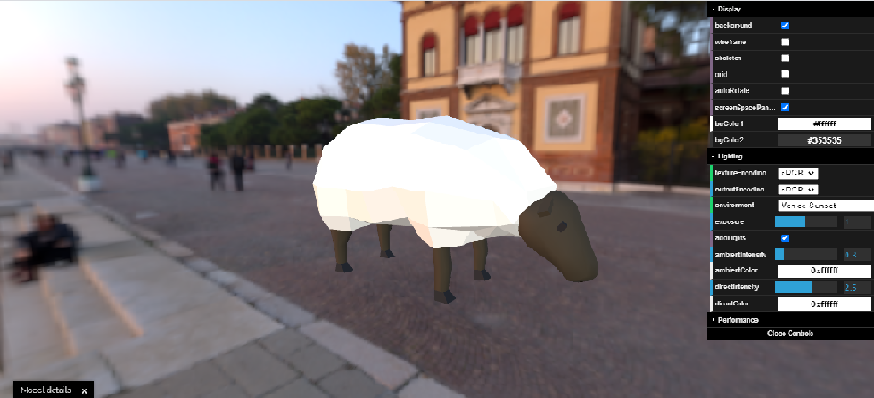

## Quickstart

### Web

```
npm install
npm run dev
```

Just drag and drop any AR components, It will show you in different background. You can find one AR sample in the project Name: sheep.glb

# This image is shown by opening : http://localhost:3000/

 
